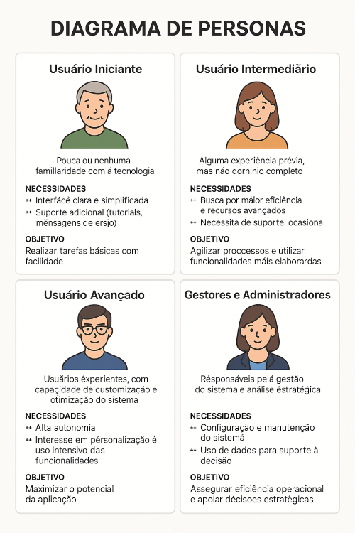
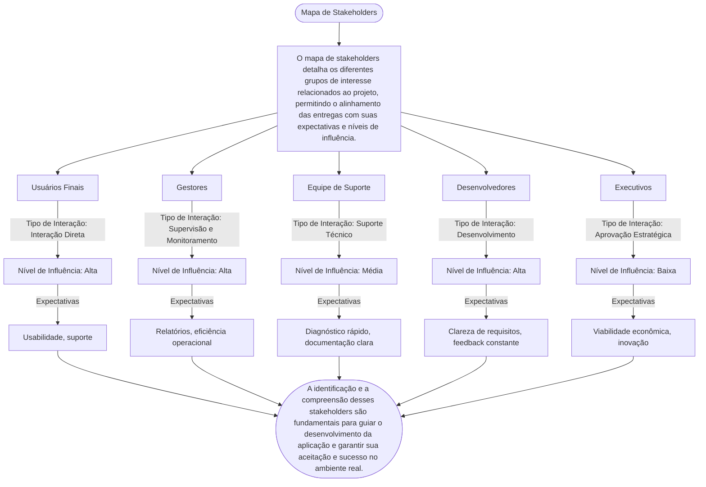

# Introdução

Este documento apresenta uma visão geral do projeto, contextualizando seu desenvolvimento e destacando os principais elementos que o motivam. São abordados o cenário em que o projeto está inserido, o problema que se pretende resolver, os objetivos estratégicos, a justificativa para sua realização e a definição do público-alvo.

# Problema

Nesta seção, descreve-se de maneira clara e objetiva o problema que a aplicação buscará solucionar. Evite, neste momento, mencionar a solução ou aspectos técnicos da aplicação. Apresente o contexto em que o problema ocorre — como o ambiente empresarial, tecnologias envolvidas ou fatores relevantes — sempre utilizando informações concretas e já conhecidas. Ainda não é o momento para definir requisitos ou propor soluções. Opcionalmente, pode-se aplicar metodologias como o Design Thinking para apoiar a investigação e ampliar a compreensão do problema em todas as suas dimensões.

# Objetivos

O objetivo geral do projeto é desenvolver um software que solucione o problema descrito anteriormente de forma prática e eficiente.

Os seguintes objetivos específicos nortearão o projeto:

- Pesquisar e aplicar tecnologias adequadas, considerando critérios como desempenho, escalabilidade e usabilidade.
- Explorar abordagens metodológicas que favoreçam a resolução do problema, priorizando experimentação, análise de dados e integração de funcionalidades específicas.

Esses objetivos garantirão o foco da pesquisa e orientarão a arquitetura e implementação da solução.

# Justificativa

Esta seção fundamenta tecnicamente o desenvolvimento da aplicação, destacando a motivação, os objetivos específicos e os critérios que definiram o escopo do projeto. A escolha da aplicação partiu da identificação de uma necessidade concreta ou de uma oportunidade de otimização de processos existentes. A definição dos objetivos foi orientada pela viabilidade técnica, impacto potencial e alinhamento estratégico com as tecnologias selecionadas.

Para aprofundar a compreensão do problema, serão utilizados instrumentos como:

## Métodos de Coleta de Dados

- **Questionários**: Coleta de dados quantitativos sobre necessidades e pontos de melhoria percebidos pelos usuários.
- **Entrevistas**: Obtenção de dados qualitativos aprofundados, visando entender expectativas e desafios sob a ótica dos stakeholders.
- **Análise Estatística**: Estudo de dados históricos ou de uso do sistema para identificar padrões e orientar decisões.

Esses métodos fornecerão evidências sólidas para validação de requisitos, identificação de restrições e refinamento das funcionalidades a serem implementadas.

## Exemplos de Gráficos e Tabelas

### Gráfico de Distribuição de Respostas

Apresentação visual da distribuição das respostas coletadas via questionários, destacando áreas críticas para os usuários.

**Exemplo**
> #### Nível de Satisfação
> Este gráfico representa os níveis de satisfação com base em respostas coletadas:

| Nível                 | Gráfico                                      |
|-----------------------|----------------------------------------------|
| Muito Insatisfeito    | ███                                          |
| Insatisfeito          | ████████████                                 |
| Neutro                | ████████████████████                         |
| Satisfeito            | ███████████████████████████████              |
| Muito Satisfeito      | ███████████████                              |

### Tabela de Análise de Requisitos

| Requisito             | Prioridade | Fonte de Dados     | Observações                     |
|----------------------|------------|--------------------|---------------------------------|
| Funcionalidade A     | Alta       | Questionário       | Essencial para operação         |
| Desempenho de Sistema| Média      | Entrevista         | Depende da infraestrutura       |
| Integração com API X | Alta       | Análise Estatística| Fundamental para escalabilidade |

Todas as decisões técnicas serão registradas com base nas evidências coletadas, garantindo rastreabilidade, transparência e alinhamento com as necessidades do usuário.

# Público-Alvo

A definição clara dos perfis de usuários é crucial para orientar o design e a implementação da aplicação, assegurando que ela atenda às necessidades de diferentes níveis de experiência e interação com tecnologia.

## Perfis de Usuários

### 1. Usuário Iniciante

**Descrição**: Pouca ou nenhuma familiaridade com a tecnologia.

**Características**:
- Preferência por interfaces simples.
- Necessidade de suporte adicional (tutoriais, mensagens de ajuda).

**Objetivo**: Realizar tarefas básicas com facilidade.

### 2. Usuário Intermediário

**Descrição**: Alguma experiência prévia, mas não domínio completo.

**Características**:
- Busca por maior eficiência e recursos avançados.
- Necessita de suporte ocasional.

**Objetivo**: Agilizar processos e utilizar funcionalidades mais elaboradas.

### 3. Usuário Avançado

**Descrição**: Usuários experientes com capacidade de customização e otimização do sistema.

**Características**:
- Alta autonomia.
- Interesse em personalização e uso intensivo das funcionalidades.

**Objetivo**: Maximizar o potencial da aplicação.

### Gestores e Administradores

**Descrição**: Responsáveis pela gestão do sistema e análise estratégica.

**Características**:
- Configuração e manutenção do sistema.
- Uso de dados para suporte à decisão.

**Objetivo**: Assegurar eficiência operacional e apoiar decisões estratégicas.

## Diagrama de Personas

A seguir, apresenta-se um diagrama ilustrativo dos perfis de usuários, suas necessidades e objetivos de uso do sistema.

## Mapa de Stakeholders

O mapa de stakeholders detalha os diferentes grupos de interesse relacionados ao projeto, permitindo o alinhamento das entregas com suas expectativas e níveis de influência.

| Stakeholder         | Tipo de Interação           | Nível de Influência | Expectativas                        |
|---------------------|-----------------------------|----------------------|-------------------------------------|
| Usuários Finais     | Interação Direta            | Alta                 | Usabilidade, suporte                |
| Gestores            | Supervisão e Monitoramento  | Alta                 | Relatórios, eficiência operacional  |
| Equipe de Suporte   | Suporte Técnico             | Média                | Diagnóstico rápido, documentação clara |
| Desenvolvedores     | Desenvolvimento             | Alta                 | Clareza de requisitos, feedback constante |
| Executivos          | Aprovação Estratégica       | Baixa                | Viabilidade econômica, inovação     |

A identificação e a compreensão desses stakeholders são fundamentais para guiar o desenvolvimento da aplicação e garantir sua aceitação e sucesso no ambiente real.
