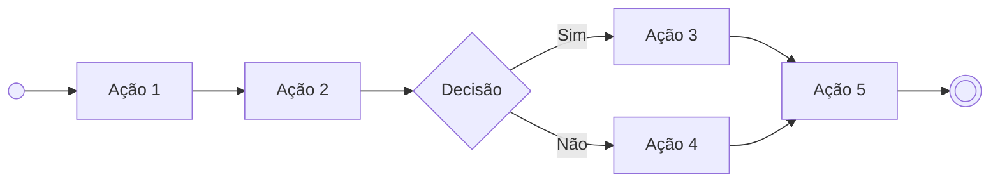
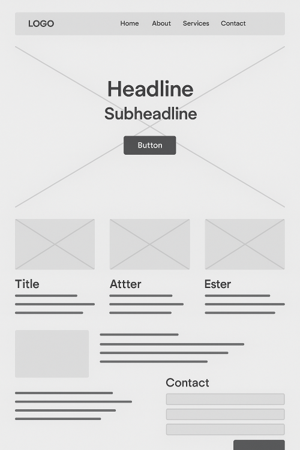

# Projeto de Interface

> **Pré-requisitos**: Consulte a <a href="02-Especificação do Projeto.md"> Especificação do Projeto</a> para obter detalhes sobre os requisitos funcionais, não funcionais e as histórias de usuário que guiaram o desenvolvimento da interface.

Este documento descreve as principais interfaces da plataforma, com foco na interação do usuário, fluxos de navegação e os protótipos interativos que demonstram as funcionalidades do sistema. A elaboração das interfaces segue as diretrizes e necessidades definidas na documentação de especificação, visando atender aos requisitos e expectativas do usuário.

## Diagrama de Fluxo

O diagrama de fluxo apresenta o caminho de interação do usuário com o sistema, sem a necessidade de detalhamento imediato do design das telas. Este diagrama é essencial para mapear as principais ações e navegação que o usuário realizará dentro do sistema. Ele ajuda a planejar as interações e assegura que o wireframe final seja eficaz e intuitivo.

### Elementos do Diagrama de Fluxo

O diagrama é composto por "caixas" (boxes) que representam as principais funcionalidades do sistema, como menus, botões e acessos, e as interações que o usuário pode realizar, como editar, pesquisar, filtrar e configurar. As conexões entre essas caixas indicam o fluxo de navegação do usuário.

## Wireframes

Os wireframes são protótipos iniciais de design utilizados para estruturar a interface de usuário de uma aplicação ou site. Eles servem como um esboço para definir a disposição dos elementos da interface e como as páginas se relacionam. No contexto do projeto, os wireframes ajudam a visualizar a estrutura da interface sem a preocupação com o design visual final.

Os wireframes são fundamentais para testar e iterar o layout da interface, garantindo que a navegação e as funcionalidades estejam claras e fáceis de usar antes de iniciar o design visual mais detalhado.

